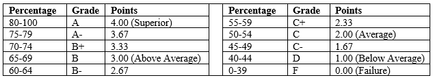

# Analysis of Student Performance in INSY107: Information Technology Today Course (2020-2023)

## Background Information
The objective of this analysis is to comprehensively assess the performance of students enrolled in the university course unit, INSY107 Information Technology Today, spanning the years 2020 to 2023. The findings from this analysis will provide valuable insights and trends to inform teaching methods and course management. 
### Key questions guiding this analysis include:
1. Are there discernible differences in the academic performance between male and female students?
2. Is there significant variation in the performance of students across different academic years?
3. Do student grades exhibit a tendency to improve over the four-year period?
4. How has the overall performance of students in INSY107 evolved from 2020 to 2023?
5. Is there any correlation between gender and academic performance in INSY107?
6. To what extent does student attendance impact their final grades in the course?
7. Can any discernible trends or patterns be identified in student attendance throughout the four-year duration?
8. Is there a noteworthy correlation between assignment scores and final exam scores?
9. Are there specific years in which students exhibited exceptional or subpar performance in INSY107?
10. Is there an observable correlation between attendance and assignment completion rates among students?

By addressing these key questions, we aim to gain a comprehensive understanding of student performance in INSY107 and provide data-driven insights to enhance the teaching and management of this course unit.
## Data Set & Privacy
* **Dataset:** **The data was cleaned using Excel to ensure there are no missing values.** The dataset (technology_today_107.csv) contains 2027 rows of student data across 8 columns, that include:
    * student ID 
    * gender 
    * year
    * attendance (5%)
    * assignments (10%)
    * tests (10%)
    * mid-semester-exam (15%)
    * final exam (60%) 
    * ***Grand Total = 5+10+10+15+60 = 100%***

* **Privacy:** This dataset uses anonymized student IDs and excludes university and student names for brevity and data privacy, all other data points in this dataset are genuine. 

## Grading Scale

## Analysis Report
**Gender Differences in Academic Performance:** Female students slightly outperformed male students across all assessments-
   * Assignments: 7.10 (F) vs. 7.02 (M)
   * Tests: 6.40 (F) vs. 6.46 (M)
   * Mid-Semester Exam: 10.10 (F) vs. 10.00 (M)
   * Final Exam: 32.76 (F) vs. 32.09 (M)
   * However, the differences are marginal and not highly significant.

**Variation in Performance Across Academic Years**
   * The lowest performance was in 2020 (Final Exam Avg: 28.49).
   * The highest performance was in 2023 (Final Exam Avg: 35.90).
   * Performance generally improved over the years, except for a drop in 2021.

**Improvement in Grades Over Four Years**
   * Student grades showed an upward trend from 2020 to 2023.
   * Assignment scores improved significantly (6.97 in 2020, 8.06 in 2023).
   * Final exam scores also increased (28.49 in 2020, 35.90 in 2023).

**Evolution of Overall Performance (2020-2023)**
   * The best year in terms of performance was 2023.
   * 2021 showed a dip in performance, especially in assignments.
   * The subject saw a general upward trend in student achievement.

**Correlation Between Gender and Academic Performance**
   * Gender differences in performance were minor.
   * No strong correlation between gender and performance.

**Impact of Attendance on Final Grades**
   * Attendance had a positive correlation with final grades (0.27).
   * Students with higher attendance tended to perform better.
